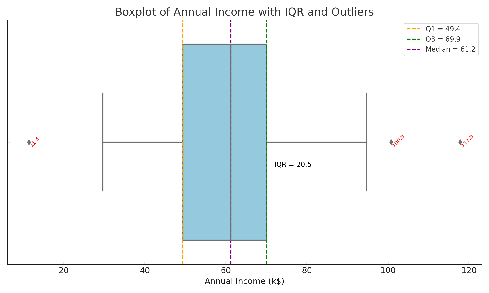

# Mathematics_For_DataScience
Maths Study for DS, ML, and NLP
A Weekly Plan for MATHS Study 
- Week 1: DESCRIPTIVE STATISTICS
  - GOALS: Understand and apply the basics of basic summary used to describe datasets
- Measure of Central Tendency
   - mean
   - median
   - mode
- Measure of Dispersion
   - Range
   - Variance
   - Standard Deviation
   - Quantile(75th percentile - 25th percentile)
### Ouliers
#### -  🧪 What Are Outliers?
 - Outliers are unusually high or low values in your dataset that differ significantly from most other values.

 - Example:
 - In this list of ages:
   - [22, 24, 25, 26, 150] — the 150 is clearly an outlier.
  

### 📉 How Outliers Affect Measures (with Examples)
#### 1. Mean – ✅ Affected by outliers
 - The mean (average) increases or decreases significantly if there's an outlier.

 - 📌 Example:
 - Ages:
  - [25, 26, 27, 28, 29] → Mean = 27
  - [25, 26, 27, 28, 100] → Mean = 41.2 ← Big change due to one outlier
##### b Insight: Mean is not robust to outliers. It can give a misleading picture.

#### 2. Median – ✅ Not affected much
 - The median is the middle value, so it’s stable even with outliers.

 - 📌 Example:
 - [25, 26, 27, 28, 100] → Median = 27
 - Same median as before!

#### 3. Mode – ✅ Not affected
 - It’s just the most frequent value, so outliers don’t matter here.

#### 4. Standard Deviation & Variance – ✅ Strongly affected
 - These measure spread of data.

 - Outliers make the spread appear wider than it actually is.

